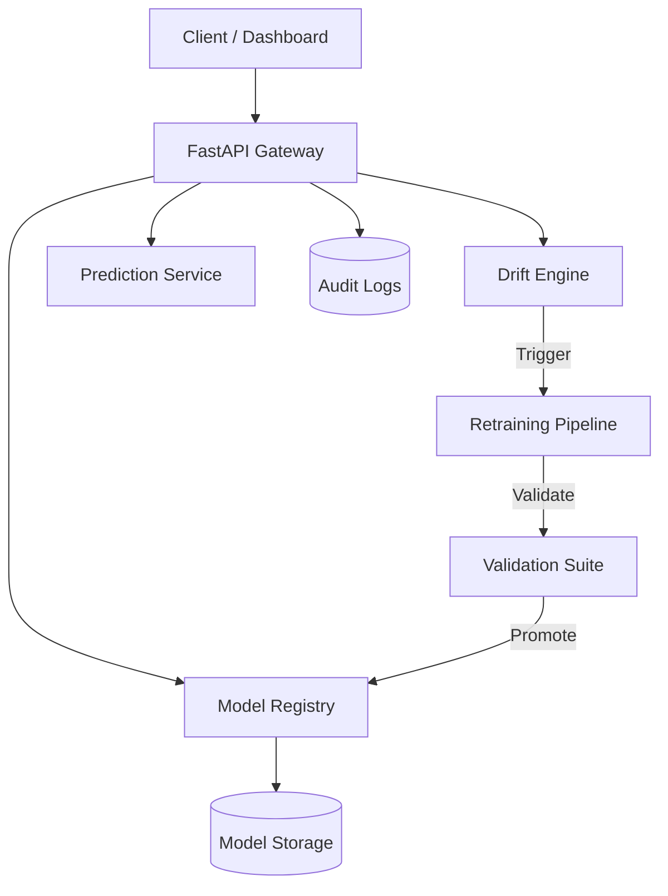

# RCD²: Real-Time Concept Drift Detector & Auto-Retraining ML Pipeline

[](https://github.com/example/rcd2/actions)
[](https://opensource.org/licenses/MIT)
[](https://www.python.org/downloads/)
[](https://github.com/psf/black)

**RCD²** is a production-grade MLOps platform designed to detect concept drift in streaming data and automatically trigger model retraining. It features a robust FastAPI backend, a real-time monitoring dashboard, and a comprehensive governance layer compliant with ISO/IEC 42001 and NIST AI RMF.


---

## 🚀 Key Features

- **🌊 Real-Time Drift Detection**:
  - **ADWIN** (Adaptive Windowing) for streaming distribution changes.
  - **PSI** (Population Stability Index) & **KS Test** for statistical validation.
  - Detects Data Drift, Concept Drift, and Prediction Drift.

- **🔄 Auto-Retraining Pipeline**:
  - Automated triggers based on drift scores (>70) or accuracy degradation.
  - **Sandboxed Execution**: Safe, isolated retraining environments.
  - **Validation Suite**: Checks performance, fairness, explainability, and stability before promotion.

- **🛡️ Governance & Security**:
  - **Model Registry**: Git-like versioning with SHA256 checksums.
  - **Audit Trails**: Immutable JSONL logs for all regulatory actions.
  - **Rollback**: Instant recovery to previous champion models.

- **📊 Monitoring Dashboard**:
  - Real-time visualization of drift scores and model accuracy.
  - Interactive controls for testing and manual triggers.

---

## �️ Installation

### Option 1: Local Setup (Python)

```bash
# Clone repository
git clone https://github.com/example/rcd2.git
cd rcd2

# Install dependencies via Makefile
make install

# Run the platform
make run
```

### Option 2: Docker (Recommended)

```bash
# Build and run with Docker Compose
docker-compose up --build
```

---

## 📖 Usage

### 1. Access the Dashboard
Navigate to **http://localhost:8000/dashboard** to view real-time metrics.

### 2. Run the Demo Scenario
Simulate a complete drift and retraining lifecycle:

```bash
make demo
```

### 3. API Interaction
Full Swagger documentation available at **http://localhost:8000/docs**.

**Authentication**
All API endpoints are secured with an API Key. You must provide the `X-API-Key` header.
Default development key: `dev-key-123` (set in Makefile).

**Example: Predict**
```bash
curl -X POST "http://localhost:8000/api/predict" \
  -H "Content-Type: application/json" \
  -H "X-API-Key: dev-key-123" \
  -d '{"features": [0.5, -1.2, 0.8]}'
```

**Example: Check Drift**
```bash
curl "http://localhost:8000/api/drift" -H "X-API-Key: dev-key-123"
```

## 🔒 Security Configuration

The platform uses **API Key Authentication** by default.

1. **Set the Key**:
   Set the `RCD2_API_KEY` environment variable before starting the server.
   ```bash
   export RCD2_API_KEY="your-secure-production-key"
   ```

2. **Automatic Generation**:
   If no key is set, the server will generate a secure random key on startup and log it to the console.

3. **Dashboard Access**:
   The dashboard will prompt you for the key on first load. It stores the key securely in your browser's LocalStorage.

See [SECURITY_UPGRADE.md](SECURITY_UPGRADE.md) for details on recent security enhancements.

---

## 🏗️ Architecture

The system follows a modular micro-service architecture:



See [ARCHITECTURE.md](ARCHITECTURE.md) for detailed design docs.

---

## 🧪 Development

### Running Tests
```bash
make test
```

### Code Quality
```bash
make lint
```

### Project Structure
```
rcd2/
├── backend/            # Core application logic
│   ├── api/            # FastAPI routers
│   ├── engines/        # ML engines (Drift, Retrain, Registry)
│   └── utils/          # Helpers (Logger, Data Stream)
├── frontend/           # Dashboard assets
├── tests/              # Pytest suite
├── examples/           # Demo scripts
├── models/             # Serialized model artifacts
├── logs/               # Audit and application logs
├── Dockerfile          # Container definition
├── Makefile            # Automation tasks
└── pyproject.toml      # Build configuration
```

---

## 🤝 Contributing

We welcome contributions! Please read [CONTRIBUTING.md](CONTRIBUTING.md) and [CODE_OF_CONDUCT.md](CODE_OF_CONDUCT.md) for details.

## � Security

For security policy and vulnerability reporting, see [SECURITY.md](SECURITY.md).

## � License

This project is licensed under the MIT License - see the [LICENSE](LICENSE) file for details.
